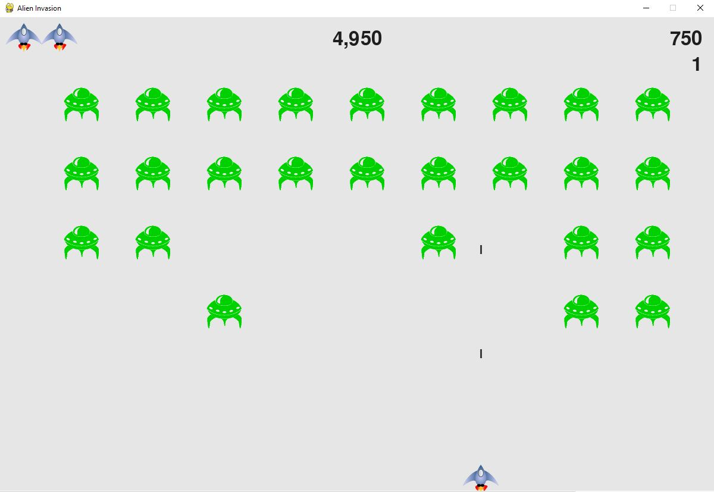

# Alien Invasion

Alien Invasion is a simple game project from the book "Python Crash Course" by Eric Matthes. This game is developed to help beginners learn Python through interactive game development. In this game, the player controls a spaceship that can move left and right, shoot bullets, and try to destroy waves of alien ships descending towards them.

## Book Description

In Alien Invasion, the player controls a ship that appears at
the bottom center of the screen. The player can move the ship
right and left using the arrow keys and shoot bullets using the
spacebar. When the game begins, a fleet of aliens fills the sky
and moves across and down the screen. The player shoots and
destroys the aliens. If the player shoots all the aliens, a new fleet
appears that moves faster than the previous fleet. If any alien hits
the player’s ship or reaches the bottom of the screen, the player
loses a ship. If the player loses three ships, the game ends.

## Table of Contents

- [Game Features](#game-features)
- [Installation](#installation)
- [Screenshots](#screenshots)

## Game Features

- Player-controlled spaceship that can move left and right.
- Ability to shoot bullets to destroy alien ships.
- Waves of descending alien ships.
- Score tracking for destroyed alien ships.
- Game over when an alien ship collides with the spaceship or reaches the bottom of the screen.

## Installation

To run the game locally, follow these steps:

1. **Clone the repository:**
   ```bash
   git clone https://github.com/murilocechin/Alien_Invasion.git
   cd alien_invasion


## Screenshots

- Game Start


- Game Running

